class: center, middle

.large-image[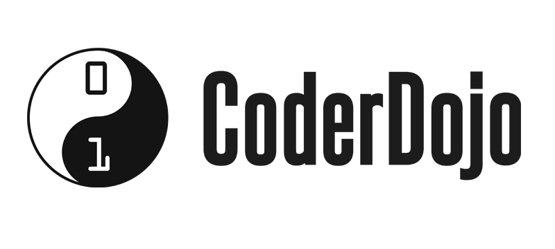]

---

class: center, middle, inverse

# Coder
## Osoba zajmująca się kodem, potocznie programista, osoba znająca się na programowaniu

---

class: center, middle

# Dojo (jap. 道場 dōjō)
## "place of the way", określenie w języku japońskim miejsca treningów sztuk walki (aikido, judo, karate, samurai)

---

class: center, middle, inverse

# Co to jest?

---

class: middle, center

# Społeczność skupiona wokół programowania i nowych technologii

???

- lokalna i niezależna społeczność
- samodzielnie prowadzona
- skupiająca się na nauce i mentoringu
- będąca częścią globalne społeczności CoderDojo

---

class: middle

.large-image[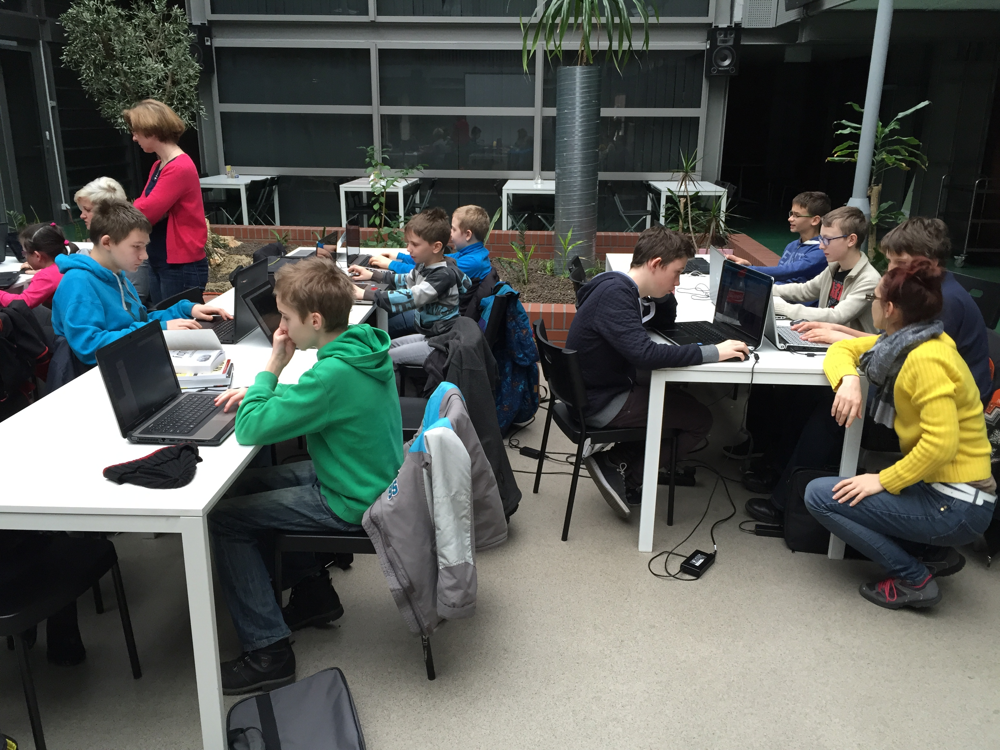]

---

class: center, middle, inverse

# Cele

---

class: middle

## Stworzenie przyjaznego miejsca do:

- pobudzania kreatywności
- frajdy z tworzenia
- organizacji klubów programowania
- ciekawego wykorzystania komputerów
- wspierania nowatorskich pomysłów
- umacniania idei równości

---

class: center, middle, inverse

# Gdzie?

---

class: center, middle

# Na całym świecie

.large-image[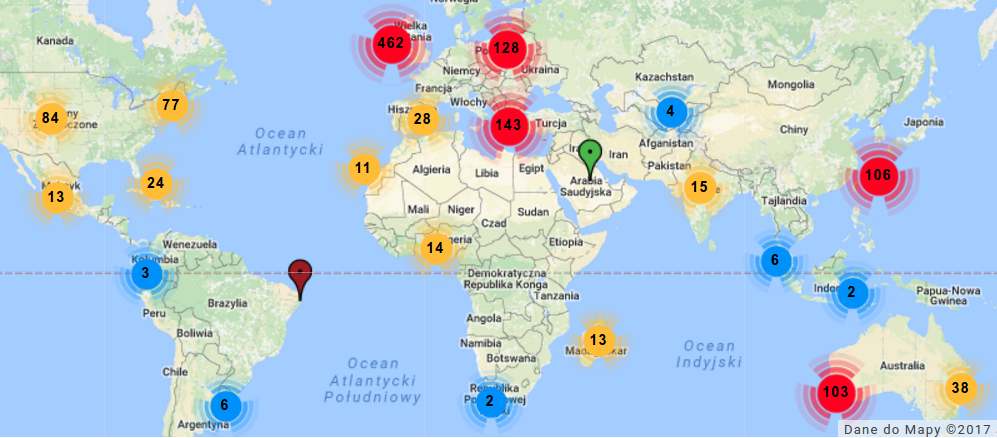]

???

- pierwsze dojo powstało w czerwcu 2011 w Dublin - Irlandia
- styczeń 2015 - ponad 550 Dojo w 55 państwach na świecie

---

class: middle, none-style-list

.large-image[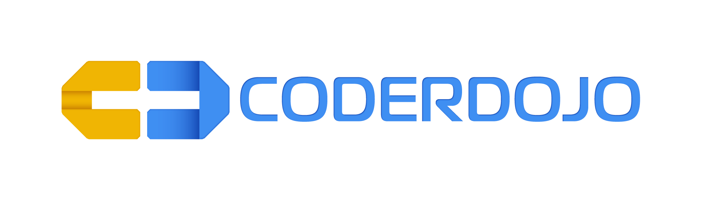]

.left-column[
- Białystok
- Bielsko-Biała
- Cieszyn
- Cisie
- Gdańsk
]

.right-column[
- Gliwice
- Kraków
- Poznań
- Warszawa
- Wrocław
- Zambrów
]

---

class: center, middle, inverse

# Kto?

---

class: middle

### Uczestnicy - zaangażowanie, pomysły, atmosfera
.large-image[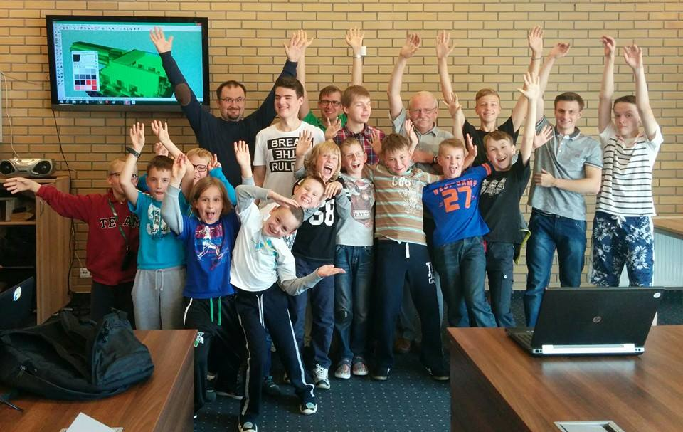]
---

class: middle

### Mentorzy - wiedza, opieka i organizacja

.large-image[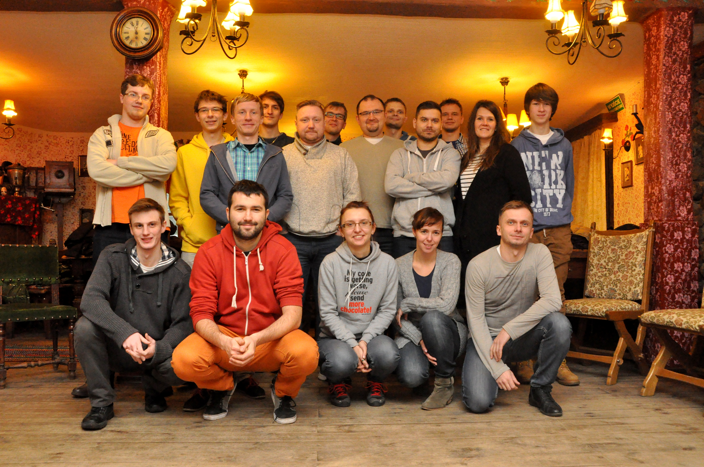]

---

class: center, middle, inverse

# Co potrzeba?

---

### Pasja

.large-image[]

???

- zaangażowanie, chęci, pasja

---

### Pomysły

.large-image[]

???

- pomysły, kreatywność

---

### Komputer + Internet

.large-image[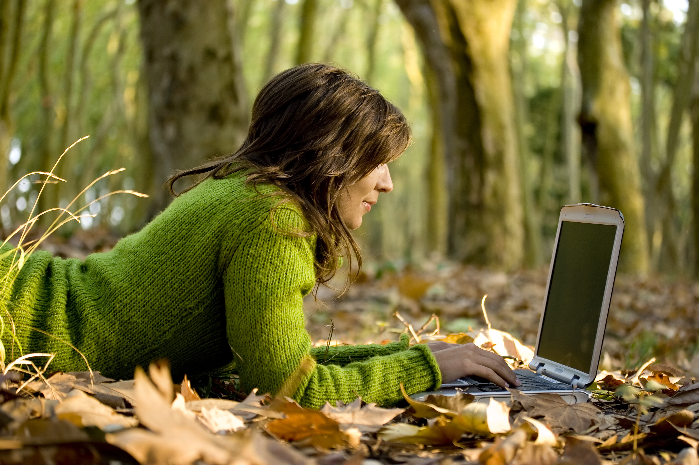]

???

- swój komputer, telefon lub tablet
- internet

---

### Miejsce

.large-image[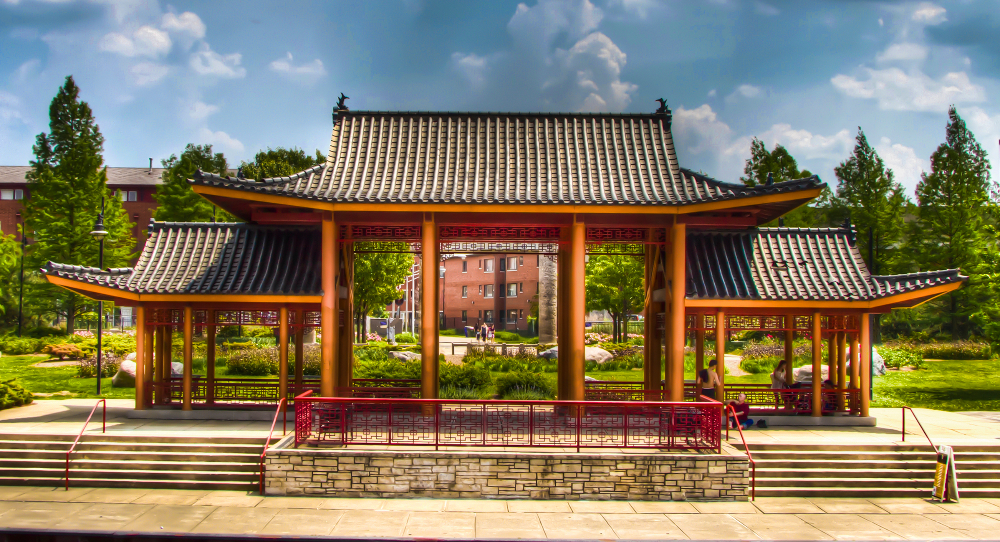]

???

### Miejsce:
- biblioteki
- parki technologiczne
- uczelnie
- szkoły
- świetlice
- domy kultury

---

class: center, middle

# Jedna zasada - bądź fajny!

.large-image[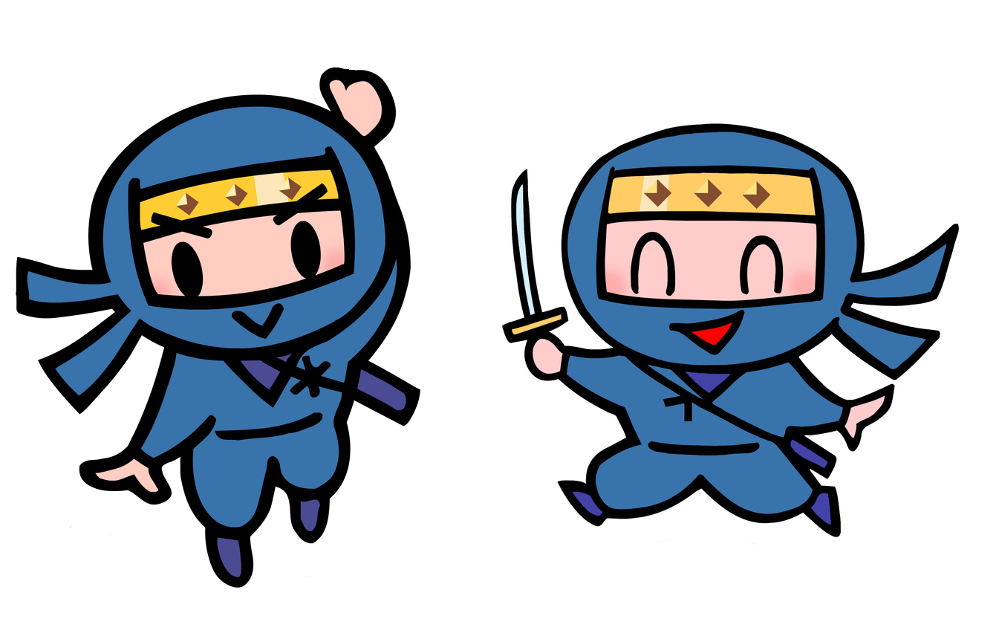]

---

class: center, middle, inverse

# Co robimy?

---

class: middle

### Druk 3D

.large-image[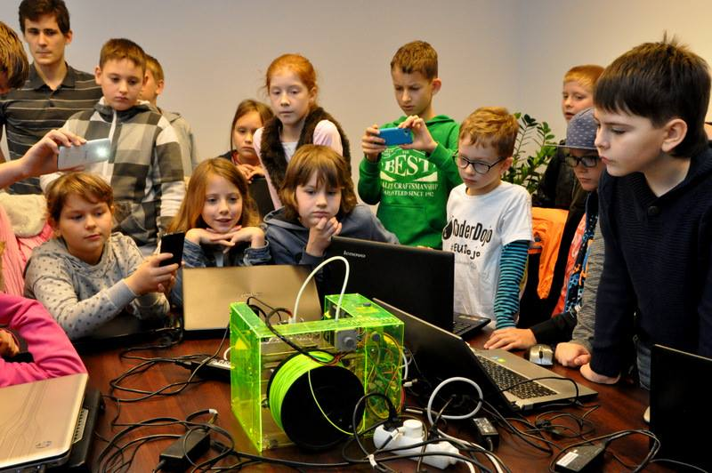]

---

class: middle

### Budowanie robotów

.large-image[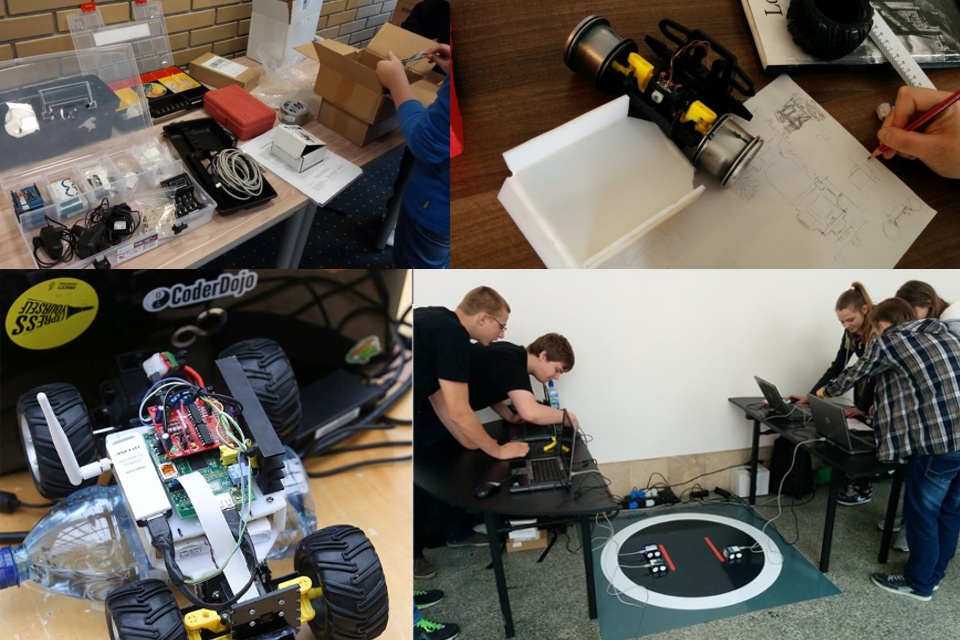]

---

class: middle

### Tworzenie gier

.large-image[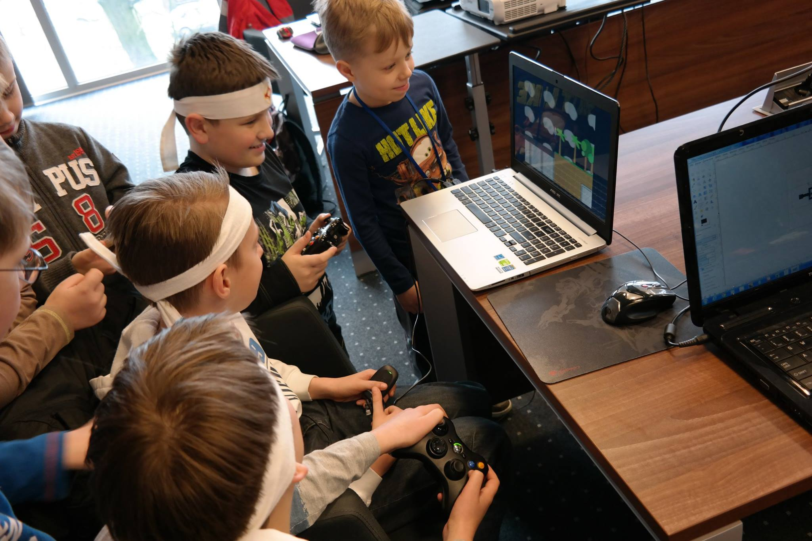]

---

class: middle

### Tworzenie grafiki i obróbka zdjęć

.large-image[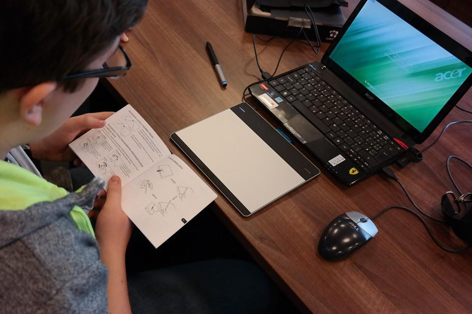]

---

### Nauka programowania

.large-image[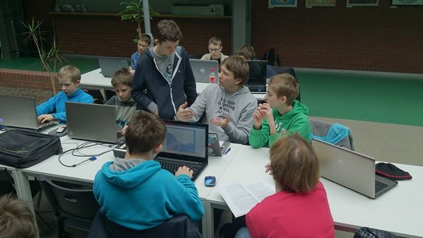]

---

class: middle

### Tworzenie stron internetowych i aplikacji mobilnych

.large-image[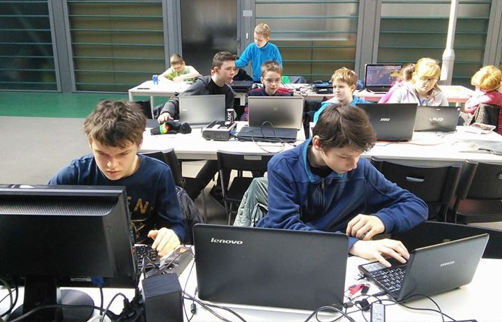]

---

class: middle

### oraz wiele innych ...

.large-image[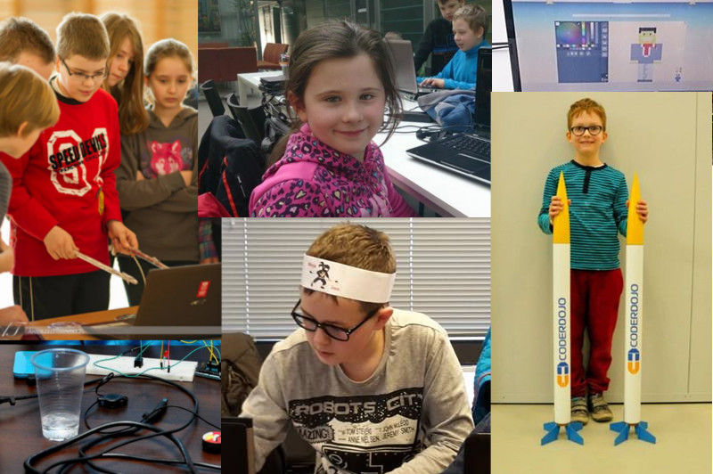]

---

class: middle, center, inverse

# Co to daje?

---

class: middle

# Co to daje?

- wiedza i jej wymiana
- nowe znajomości
- praca w zespole
- odpowiedzialność za siebie i innych, za dojo
- pobudzanie kreatywności
- wzajemna pomoc
- rozwój umiejętności społecznych

---

class: middle, center, inverse

# Jak założyć CoderDojo?

---

class: middle

# Jak założyć CoderDojo?

1. Znajdź dwóch mentorów (Ty + 1)
2. Znajdź salę
3. Wyznacz termin
4. Poinformuj świat
5. Bądź fajny!

---

.large-image[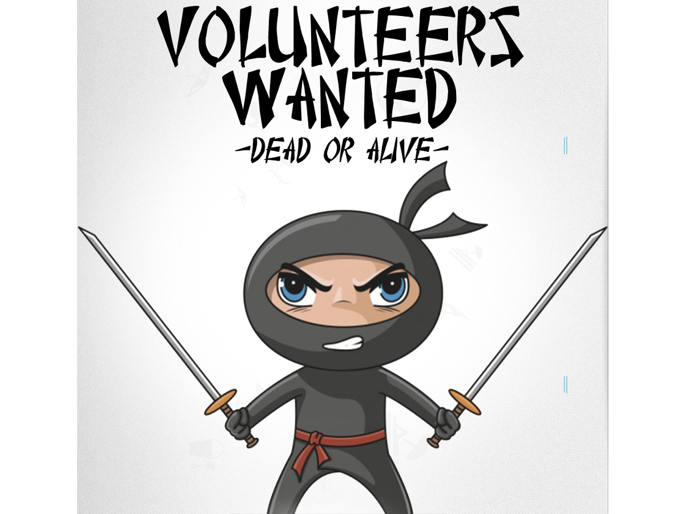]

---

class: middle, center, sygnature

.small-image[]
### Agnieszka Matysek

[ Woman on Rails](http://womanonrails.com/)

[ @womanonrails](https://twitter.com/womanonrails)

amatysek@fractalsoft.org

gliwice@coderdojo.org.pl

---

class: middle

# Bibliografia

- [CoderDojo](https://coderdojo.com/)
- [CoderDojo Polska](http://coderdojo.org.pl/)

- [Flickr - Passion](https://www.flickr.com/photos/pinkmoose/178865612)
- [Flickr - Place](https://www.flickr.com/photos/59761838@N08/7328633848)
